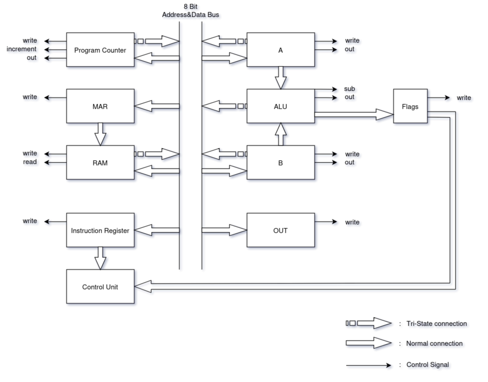

# 8-Bit SAP Computer

This is an 8-bit computer design inspired by SAP-1. [1]



## Running The Simulation

The Logisim version used in this project requires at least Java 21. Make sure you cover this.

Running logisim:

```
java -jar logisim/logisim-evolution-3.9.0.jar
```

After logisim starts you can open the `logisim/SAP.circ` file and explore!

## Instruction Set

| Instruction | Length | Description |
|---|:---:|---|
| NOP | 1 | No operation |
| HLT | 1 | Stop clock |
| LDAI num | 2 | Load A register with immediate value |
| LDA addr | 2 | Load A register with memory content |
| STA addr | 2 | Store A register content to memory |
| LDBI num | 2 | Load B register with immediate value |
| LDB addr | 2 | Load B register with memory content |
| STB addr | 2 | Store B register content to memory |
| ADD num | 2 | Sum immediate value and A register and put the result to A register |
| ADD addr | 2 | Add memory content to A register and put the result to A register |
| SUB num | 2 | Subtract immediate value from A register and put the result to A register |
| SUB addr | 2 | Subtract memory content from A register and put the result to A register |
| ADD | 1 | Sum A and B registers and put the result to A register |
| SUB | 1 | Subtract B register from A register and put the result to A register |
| OUT | 1 | Put A register content to OUT register |
| JMP addr | 2 | Jump to the given address |
| JZ addr | 2 | Jump to the given address if the zero flag is 1 |
| JC addr | 2 | Jump to the given address if the carry flag is 1 |

## Writing and Running Assembly Code

There are some programs that you can try in the `/assembly` folder which are already compiled and their binary files are in the `/memory/ram` folder. You can try these programs by right clicking to the RAM module and selecting `load content` in logisim. This will load the RAM with the selected file content. Then you can start clock to run the program.

If you'd like to write your own programs and run those, you can do so by compiling the assembly code with the `/script/assembler.py` and then loading the compiled file to the RAM.

Usage example: `python script/assembler.py assembly/fibonacci.asm`

## Control Unit

Microprogrammed control unit is used as it is easier to develop and implement.

### Control Unit Inputs

- 5 bit - OpCode
- 4 bit - Micro step counter
- 2 bit - ALU Flags

### Optimizations:

- [ ] **Microcode Memory Input Bit Reduction:** Instead of using 2 bits for the flags, we might specify which flag is needed for the instruction in the unused 3 bits of the OpCode and direct only the needed flag to the control unit, this way we can use 1 bit instead of 2 bits for the flags (mux).

- [ ] **Microcode Memory Waste Solution:** For the instructions that flags aren't important, microcode memory is wasted as we need to write the same data for all of the possibilites of the flag inputs.
To prevent this, we might use the unused 3 bits of the OpCode. We could set a specific bit 1 if the instruction is dependant to the flags and 0 if flags isn't important for the instruction, afterwards we could decode this information and set the flags input to always 1 for the non-dependant instructions and direct the real flag input for the dependant instructions.

### Control Word

| Abbreviation | Description |
|:---:|---|
| PCW | load bus content to PC |
| PCO | put PC content to bus |
| PCI | Program Counter increase |
| END | Resets the microprogram counter |
| ML | MAR latch address from bus |
| MO | put RAM content to bus |
| MW | load bus content to RAM |
| IRW | load bus content to IR |
| AW | load bus content to A register |
| AO | put A register content to bus |
| BW | load bus content to B register |
| BO | put B register content to bus |
| OW | load bus content to OUT register |
| FW | latch ALU flags to flags register |
| ALS | ALU subtraction mode |
| ALO | put ALU content to bus |
| HLT | Halt the clock |

#### Optimizations:

- [ ] **Control Word Size Reduction:** One of the limitations of using unified bus for both data and address is at most one module's content can be put into the bus. Based on this, instead of using seperate bits for controlling each module's bus-out signal we can use n bits for controlling 2^n module's bus-out signal (decoder).

## Reference

1. Albert Paul Malvino and Jerald A. Brown. 1982. Digital Computer Electronics (2nd. ed.). McGraw-Hill.
2. Eater, Ben. “Building an 8-bit computer from scratch”. 2017. [eater.net/8bit](https://eater.net/8bit)
